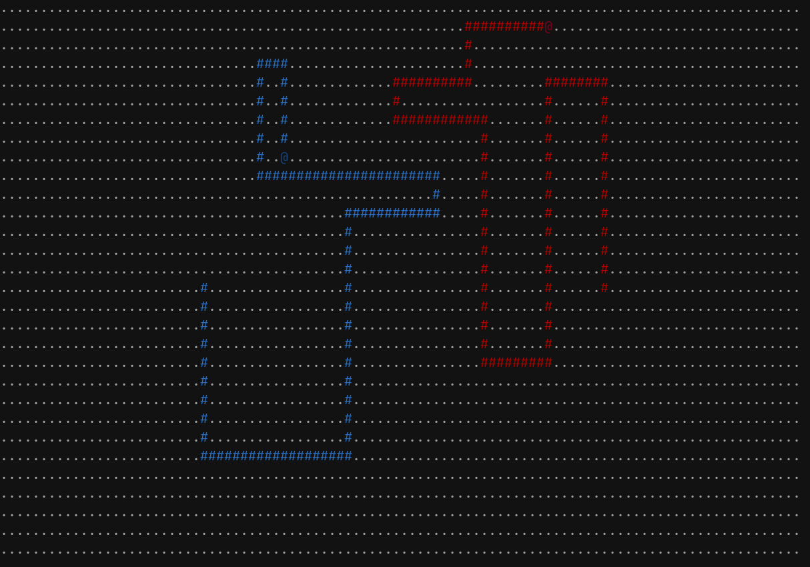
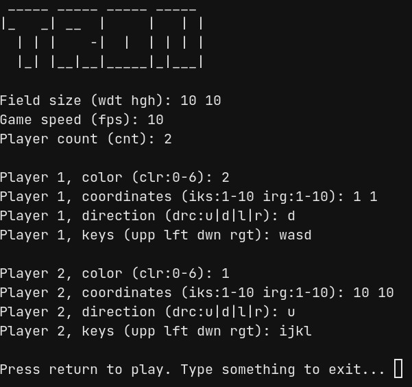
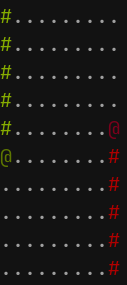

```
 _____ _____ _____ _____ 
|_   _| __  |     |   | |
  | | |    -|  |  | | | |
  |_| |__|__|_____|_|___|
```

## What is this
This is small tron game implementation on python. You can play it with friend even on a scool pc

## Installing
Linux (Manualy):
- Download source code or clone the repository
- Install theese dependencies with `pip`:
- `keyboard`
- `colorama`
- Run file `run.sh` with `sudo` (`sudo` is needed because `keyboard` lib can't operate without it)

Linux (Executable):
- Open latest release
- Download file `tron-x.x.x-linux`
- Run the file

Windows (Executable):
- Open latest release
- Download file `tron-x.x.x-windows`
- Run the file

## Playing
Main menu (See [gallery](#gallery)):
- You can change field size, fps
- You can define colors, start positions, directions and keys to control each player
- If you type nothing into the field, the default value would be used
- Here are defaults:
  - Size: 100 30
  - FPS: 10
  - Players:
    - Player 1:
      - Color: blue
      - Position: 25 15
      - Direction: down
      - Keys: `wasd`
    - Player 2:
      - Color: red
      - Position: 75 15
      - Direction: up
      - Keys: `ijkl`

Game:
- You can turn each bike (`@`) using selected earilier keys
- When bike collides with a wall or trail of another bike it will be destroed
- Game ends when there are only 1 or less bikes remaining

## Gallery




## Credits
Used libraries are:
  - [`Colorama`](https://pypi.org/project/colorama/) by wiggin15 and tartley
  - [`Keyboard`](https://pypi.org/project/keyboard/) by BoppreH
